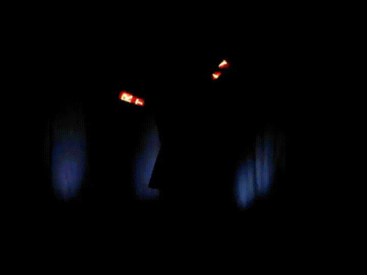

This is a set of scripts that process video of POV displays to show the effect better.

They do so by processing and combining a number of previous frames and overlaying the result over the current frame, leading to a "trail" effect.
This works best for slow-motion (i.e. high-framerate) video, because most POV displays move too much in between two frames of a 30fps video to create a convincing effect.

Here's an example made from a 120fps video (click for imgur version):
[](https://imgur.com/gallery/MKt6xVz)

`trails_dirty.sh` is the fastest version, and includes an option to define not just the trail size, but also darken the light trail, but as the name implies, cuts some corners compared to `trails.sh`.

# General Usage

```bash
$ ./trails_dirty.sh input_video.mp4 50  # use 50 frames to create the light trail
```
